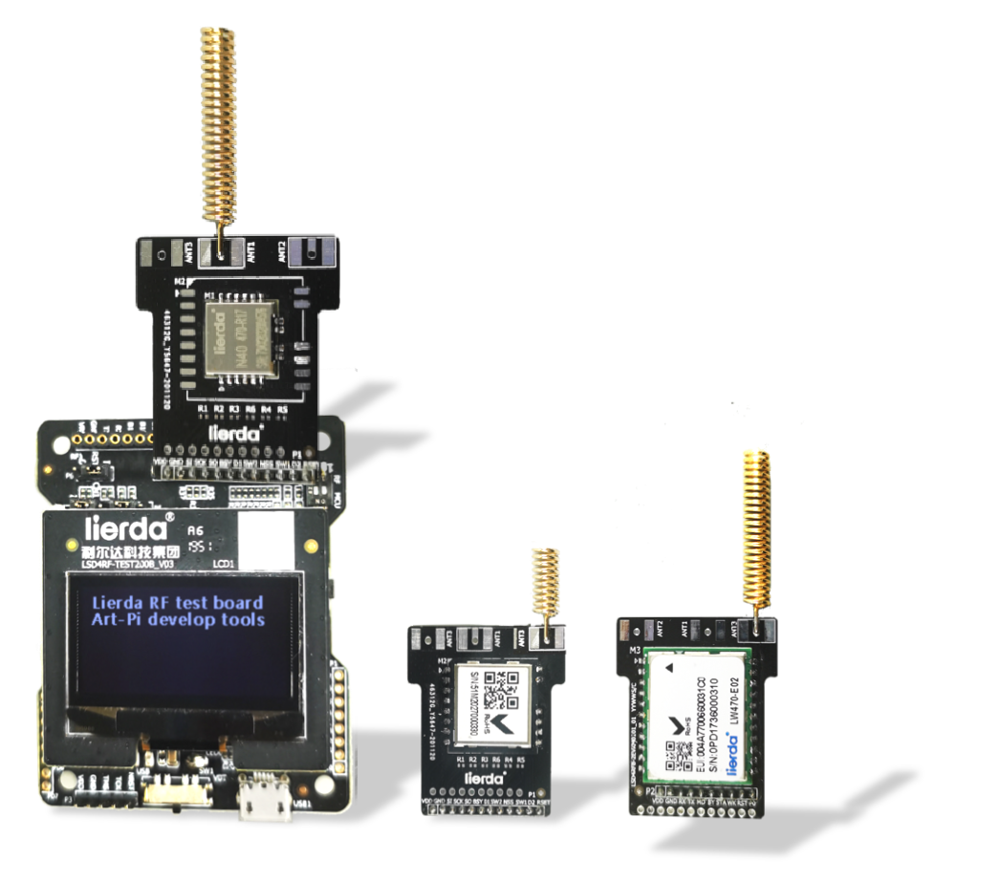
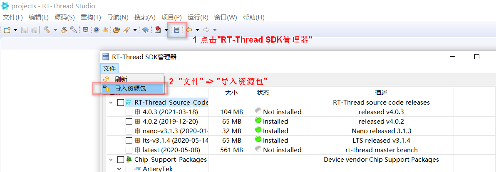
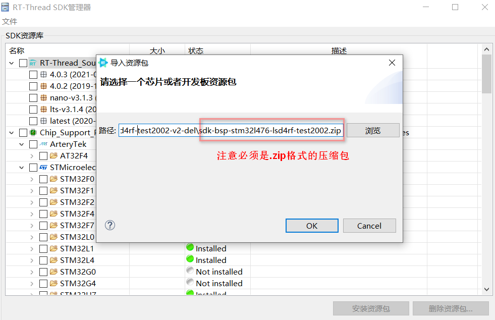

## 简介

sdk-bsp-stm32l476-lsd4rf-test2002 是  [ART-Pi LoRa 开发套件](http://wsn.lierda.com/index.php/Home/product/detail/id/113.html)——RF评估板LSD4RF-TEST2002[STM32L4] EVB的开发板支持包，可用作开发SDK包，方便用户快速开发自己的应用程序。

当前SDK包中包含了led、lora  radio、LoRaWAN End-Device 、低功耗、OLED等示例工程。



## 目录结构

```
$ sdk-bsp-stm32l476-lsd4rf-test2002
├── README.md
├── sdk-bsp-stm32l476-lsd4rf-test2002.yaml
├── documents
│   └── images
├── drivers
├── libraries
│   ├── STM32L4xx_HAL_Driver
│   ├── CMSIS
│   └── SConscript
├── projects
│   ├── blink_led
│   ├── lrs101_lora_radio
│   ├── lrs101_lorawan_ed
│   ├── lrs101_lorawan_ed_pm
│   └── oled_sh1106_u8g2
└── rt-thread
```

- sdk-bsp-stm32l476-lsd4rf-test2002.yaml
  - 描述 LSD4RF-TEST2002[STM32L4]的硬件信息
- documents
  - 图片 等
-  libraries
  - STM32L4 固件库等
- drivers
  - 通用外设驱动
-  projects
  - 示例工程文件夹
    - blink_led  
      - LED闪烁与串口Shell
      - 用户可基于该示例搭建基础项目模板
    - lrs101_lora_radio 
      - lora radio Shell,支持单\双向、空口抓包等功能
      - 用户可基于该示例构建lora-radio通信应用、功能测试等
    - lrs101_lorawan_ed
      - LoRaWAN End Device Shell，支持lorawan class A\C、confirm\unconfirm等功能
      - 用户可基于该示例构建LoRaWAN终端设备的通信应用、功能测试等
    - lrs101_lorawan_ed_pm
      - LoRaWAN End Device Class A低功耗应用示例
      - 用户可基于该示例构建类似一键报警、环境监测等低功耗应用
    - oled_sh1106_u8g2
      - 基于u8g2的OLED屏幕应用，动态显示RTC时间等
      - 用户可基于该示例构建OLED屏幕字符、图像等显示功能
-  rt-thread
  - rt-thread 源码
## 使用

sdk-bsp-stm32l476-lsd4rf-test2002 当前支持 RT-Thread Studio 2.1.0版本

### 基于RT-Thread Studio 开发

1. 下载sdk-bsp-stm32l476-lsd4rf-test2002到本地，然后压缩为.zip格式的压缩包

2. 打开 RT-Thread Studio 的包管理器，导入 LSD4RF-TEST2002 SDK 资源包

''


3. 选择.zip格式的支持包(sdk-bsp-stm32l476-lsd4rf-test2002.zip)
   

4. 支持包安装完成后，选择基于 BSP 创建工程即可


## 注意

1. 使用RT-Thread Studio开发时，注意工程所在文件路径尽量不要太深,必须因文件路径过长，导致可能出现的编译过程出错等情况。