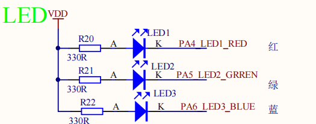
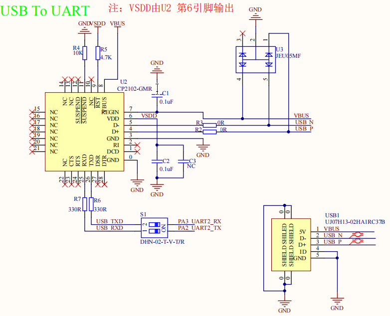

# LED闪烁例程

## 简介

本例程主要功能是让板载的 RGB-LED 中的蓝色 LED 不间断闪烁，同时支持串口shell
这个例程也可以做为您的创作的基础工程。

## 硬件说明

​	RGB-LED 属于共阳 LED， **阴极** 分别与单片机的引脚相连。单片机引脚输出低电平即可点亮 LED，输出高电平则会熄灭 LED。如下图所示



​	USB转串口采用CP2102，如下图所示




## 软件说明

闪灯的源代码位于 `/projects/blink_led/applications/main.c` 中。

drivers\board.h首先定义了LED引脚宏与串口引脚宏 ，如下所示:

```
#define BSP_LED1_PIN       GET_PIN(A, 4)
#define BSP_LED2_PIN       GET_PIN(A, 5)
#define BSP_LED3_PIN       GET_PIN(A, 6)

#define BSP_USING_UART2
#define BSP_UART2_TX_PIN       "PA2"
#define BSP_UART2_RX_PIN       "PA3"
```

在 main 函数中，将该引脚配置为输出模式，通过串口输出“Hello RT-Thead”，并在下面的 while 循环中，周期性（500毫秒）开关 LED。

```
int main(void)
{
    int count = 1;

    rt_pin_mode(BSP_LED1_PIN, PIN_MODE_OUTPUT);

    LOG_D("Hello RT-Thread!");

    while (count++)
    {
        rt_thread_mdelay(500);
        rt_pin_write(BSP_LED1_PIN, PIN_LOW);
        rt_thread_mdelay(500);
        rt_pin_write(BSP_LED1_PIN, PIN_HIGH);
    }

    return RT_EOK;
}
```

## 运行
### 编译&下载

编译完成后，通过JLINK或者ST-Link连接到LSD4RF-TEST2002 SWD接口（P3），然后将固件下载至开发板。

### 运行效果

正常运行后， LED 会周期性闪烁。串口输出“Hello RT-Thread”
