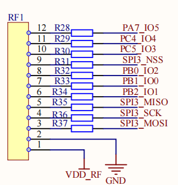

# LoRaWAN-ED-Stack Shell例程

## 简介

LoRaWAN-ED-Stack Shell示例程序主要功能是通过串口shell命令来控制LoRaWAN End Device实现LoRaWAN Class A\C入网、LoRaWAN网络上下行信号链路测试、通信测试等功能。

该例程基于LSD4RF-TEST2002[STM32L4]与LoRa模块转接板(LRS101)实现，该示例建立在lora-radio例程之上，LRS101使用了470M LoRa模块(LSD4RF-2R717N40[SX1268])。

[LSD4RF-2R717N40[SX1268]](http://bbs.lierda.com/forum.php?mod=viewthread&tid=87)主要技术参数：

- LoRa芯片：SX1268
- 频段范围：470~510M
- 发射性能：~105mA@ 22dBm(max)
- 接收性能:  ~6mA, -124dBm@SF7&BW125
- 晶振类型：TCXO
- 通信接口：SPI

## 硬件说明

如上图所示，LRS101转接板的M1位号当前默认贴装470M LoRa模块(LSD4RF-2R717N40[SX1268])，其采用硬件SPI接口(SPI3)与LSD4RF-TEST2002[STM32L4]主板RF1接口连接。

## 软件说明

基于RT-Thread Studio的lorawan-ed-stack软件包使用参考如下

lorawan-ed-stack的测试代码当前采用的是 sdk-bsp-stm32l476-lsd4rf-test2002\projects\lrs101_lorawan_ed
具体使用方式可参考[《lorawan-ed-stack软件包使用说明》](https://github.com/Forest-Rain/lorawan-ed-stack/tree/master/doc)

## 运行
### 编译&下载

编译完成后，将开发板的 ST-Link USB 口与 PC 机连接，然后将固件下载至开发板。

### 运行效果

- LoRaWAN Region 采用 CN470 By User Define 自定义频率方式
  - 上下行同频
    - 工作频率 475.3、475.5、475.7、475.9、476.1、476.3、476.5、476.7
- 设置设备身份信息DevEUI、Appkey、JoinEUI(AppEUI),缺省为Class A、非确认帧、OTAA模式
- lorawan shell命令
  - 使用lorawan join启动设备入网
  - 设备成功入网后，使用lorawan ping查看检测网络上下行链路。执行lorawan ping后，缺省发送10个数据包后，统计上下行通信链路情况
  - 使用lorawan tx 1 手动发送一个数据包
  - 使用lorawan confirm 1设置为确认帧
  - 使用lorawan tx 500 每10s周期定时发送，最大发送500个数据包
  - 使用lorawan tx 10000 设置为10s周期，定时发送数据包

。

## 注意事项

1. LoRaWAN Class A通信对时序要求相对较高，当前示例使能multi-rtimer软件包来提供定时\超时服务（STM32平台）。也可根据实际情况，使用了内核的rt_timer来提供定时服务。
2. 如果使能ulog进行日志输出，需要开启“Enable ISR log”，为了保证日志输出完整，“日志最大长度”建议设置≥384
3. 根据实际使用的LoRaWAN服务器平台，修改设备的DevEUI、AppEUI、AppKey参数
4. 当前示例主要测试“CN470”、“CN470自主定义频率”两种Regional方式
5. 使用RT-Thread Studio IDE开发，lorawan-ed-stack中使用了ceil、floor等函数，因此需要开启"组件"->"RT-thread组件"->"POSIX层与C标准库"-> "Enable libc APIs from toolchain"
6. 如果开启lorawan-ed-stack Debug功能，需要增加系统软定时器线程的任务栈大小("内核"->"Property"->"使能软件定时器"->"定时器线程的栈大小"，比如修改为2048)，否则可能会出现任务堆栈溢出。
7. 运行lora radio、lorawan-ed-stack测试，系统主频不能太低，否则可能会出现通信阻塞的情况

