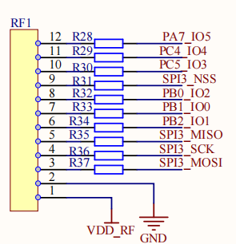
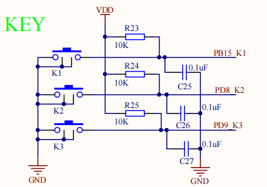

# LoRaWAN-ED-Stack Class A Low Power例程

## 简介

LoRaWAN-ED-Stack Class A Low Power示例程序主要功能是

- LoRaWAN Class A 低功耗周期性数据上报
  - 整板静态功耗~4uA
- 按键退出\进入睡眠模式（低功耗状态）
  - KEY1\KEY2\KEY3 第一次按下退出睡眠，第二次按下相同按键进入睡眠，如此循环
- 系统退出睡眠状态下，可通过串口shell命令来控制LoRaWAN End Device实现LoRaWAN Class A\C入网、LoRaWAN网络上下行信号链路测试、通信测试、LoRaWAN参数配置等功能

用户可基于该示例构建类似一键报警、环境监测等低功耗应用

该例程基于LSD4RF-TEST2002[STM32L4]与LoRa模块转接板(LRS101)实现，该示例建立在lora-radio例程之上，LRS101使用了470M LoRa模块(LSD4RF-2R717N40[SX1268])。

[LSD4RF-2R717N40[SX1268]](http://bbs.lierda.com/forum.php?mod=viewthread&tid=87)主要技术参数：

- LoRa芯片：SX1268
- 频段范围：470~510M
- 发射性能：~105mA@ 22dBm(max)
- 接收性能:  ~6mA, -124dBm@SF7&BW125
- 晶振类型：TCXO
- 通信接口：SPI

## 硬件说明

LoRa模块接口如上图所示

LRS101扩展板的M1位号当前默认贴装470M LoRa模块(LSD4RF-2R717N40[SX1268])，其采用硬件SPI接口(SPI3)与LSD4RF-TEST2002[STM32L4]主板RF1接口连接。

LSD4RF-TEST2002 3个用户按键接口如上图所示

## 软件说明

基于RT-Thread Studio的lorawan-ed-stack软件包使用参考如下

lorawan-ed-stack的测试代码当前采用的是 sdk-bsp-stm32l476-lsd4rf-test2002\projects\lrs101_lorawan_ed_pm
具体使用方式可参考[《lorawan-ed-stack软件包使用说明》](https://github.com/Forest-Rain/lorawan-ed-stack/tree/master/doc)

## 运行
### 编译&下载

编译完成后，将开发板的 ST-Link USB 口与 PC 机连接，然后将固件下载至开发板。

### 运行效果

- LoRaWAN Region 采用 CN470 By User Define 自定义频率或者CN470方式
  - CN470S同频 （#define REGION_CN470S_FREQ_UP_DN_EQU）
    - 下行(RX1)=上行 
    - 工作频率 475.3、475.5、475.7、475.9、476.1、476.3、476.5、476.7
  - CN470S(异频)  （#define REGION_CN470S_FREQ_UP_DN_DIF）
    - 上行
      - 475.1、475.3、475.5、475.7、475.9、476.1、476.3、476.5
    - 下行（RX1）
      - 505.1、505.3、505.5、505.7、505.9、505.1、505.3、505.5
- 设置设备身份信息DevEUI、Appkey、JoinEUI(AppEUI)，缺省为Class A、非确认帧、OTAA模式等参数
- 默认情况下，在设备上电后，自动开始OTAA入网，用户无操作情况下，系统处于睡眠模式(STOP2)
- 设备入网成功后，在睡眠模式、Class A方式周期性上报数据包
- 若需要进行lorawan shell操作:
  - 先按下KEY1\KEY2\KEY3任一按键，触发系统退出睡眠模式，再次按下相同按键后，系统重新进入睡眠状态
  - 系统退出睡眠状态情况下，lorawan shell操作命令有：
    - 使用lorawan join启动设备入网
    - 设备成功入网后，使用lorawan ping查看检测网络上下行链路。执行lorawan ping后，缺省发送10个数据包后，统计上下行通信链路情况
    - 使用lorawan tx 1 手动发送一个数据包
    - 使用lorawan confirm 1设置为确认帧
    - 使用lorawan tx 500 每10s周期定时发送，最大发送500个数据包
    - 使用lorawan tx 10000 设置为10s周期，定时发送数据包

​	LoRaWAN Class A功耗测试，如下所示

- LoRaWAN Class A 
  - 入网、数据通信，其他处于STOP2模式
- 按键唤醒&睡眠
  - 退出DEEP睡眠模式，再次按下，再次进入STOP2模式

## 注意事项

1. LoRaWAN Class A通信对时序要求相对较高，当前示例使能multi-rtimer软件包来提供定时\超时服务（STM32平台）。也可根据实际情况，使用了内核的rt_timer来提供定时服务。
2. 如果使能ulog进行日志输出，需要开启“Enable ISR log”，为了保证日志输出完整，“日志最大长度”建议设置≥384
3. 根据实际使用的LoRaWAN服务器平台，修改设备的DevEUI、AppEUI、AppKey参数
4. 当前示例主要测试“CN470”、“CN470自主定义频率”两种Regional方式
5. 使用RT-Thread Studio IDE开发，lorawan-ed-stack中使用了ceil、floor等函数，因此需要开启"组件"->"RT-thread组件"->"POSIX层与C标准库"-> "Enable libc APIs from toolchain"
6. 如果开启lorawan-ed-stack Debug功能，需要增加系统软定时器线程的任务栈大小("内核"->"Property"->"使能软件定时器"->"定时器线程的栈大小"，比如修改为2048)，否则可能会出现任务堆栈溢出。
7. 运行lora radio、lorawan-ed-stack测试，系统主频不能太低，否则可能会出现通信阻塞的情况

