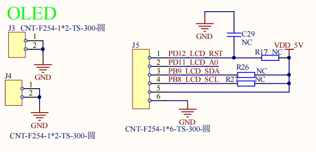
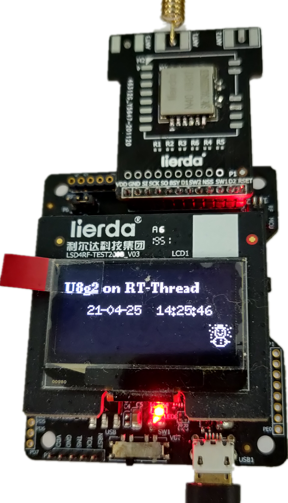

# u8g2 oled显示例程

## 简介

本例程主要实现了基于u8g2软件包驱动OLED屏幕，并动态刷新显示RTC实时时间。

## 硬件说明

​	OLED（Organic Light-Emitting Diode）屏幕采用的驱动芯片为SH1106，接口电路如下




## 软件说明

闪灯的源代码位于 `/projects/oled_sh1106_u8g2/applications/main.c` 中。

示例程序中使用u8g2软件包，使用rt-thread i2c设备驱动(i2c1)。

在board.h定义OLED屏幕使用的i2c引脚

```
#ifdef BSP_USING_I2C1
#define BSP_I2C1_SCL_PIN    GET_PIN(B, 8)
#define BSP_I2C1_SDA_PIN    GET_PIN(B, 9)
#endif`
```

u8g2 oled接口初始化如下所示

```
// LSD4RF-TEST2002 OLED
#define OLED_PIN_RESET GET_PIN(D,12)
#define OLED_PIN_DC    GET_PIN(D,11)

int u8g2_oled_sh1106_init(void)
{
    // Initialization
    u8g2_Setup_sh1106_i2c_128x64_noname_f(&u8g2, U8G2_R0, u8x8_byte_rt_hw_i2c, u8x8_rt_gpio_and_delay);

    u8x8_SetPin(u8g2_GetU8x8(&u8g2), U8X8_PIN_RESET, OLED_PIN_RESET);
    u8x8_SetPin(u8g2_GetU8x8(&u8g2), U8X8_PIN_DC, OLED_PIN_DC);

    u8g2_InitDisplay(&u8g2);
    u8g2_SetPowerSave(&u8g2, 0);

    /* Test U8G2 OLED function */

    /* full buffer example, setup procedure ends in _f */
    u8g2_ClearBuffer(&u8g2);
    u8g2_SetFont(&u8g2, u8g2_font_logisoso16_tf);
    u8g2_DrawStr(&u8g2, 25, 42, "Loading...");
    u8g2_SendBuffer(&u8g2);

    rt_thread_mdelay(500);

    /* full buffer example, setup procedure ends in _f */
    u8g2_ClearBuffer(&u8g2);
    u8g2_SetFont(&u8g2, u8g2_font_ncenB08_tr);
    u8g2_DrawStr(&u8g2, 1, 18, "U8g2 on RT-Thread");
    u8g2_SendBuffer(&u8g2);

    // Draw Graphics
    u8g2_SetFont(&u8g2, u8g2_font_unifont_t_symbols);
    u8g2_DrawGlyph(&u8g2, 112, 56, 0x2603 );
    u8g2_SendBuffer(&u8g2);

    /* End of Test U8G2 OLED function */

    /* oled test thread for rtc display */
    rt_thread_t tid1 = RT_NULL;
      tid1 = rt_thread_create("u8g2_oled",
              oled_update_thread_entry, RT_NULL,
                           1024, RT_THREAD_PRIORITY_MAX-1, 5);

      if (tid1 != RT_NULL)
          rt_thread_startup(tid1);
      return 0;

    return 0;
}
INIT_APP_EXPORT(u8g2_oled_sh1106_init);
```

在 oled_update_thread_entry线程中，周期刷新OLED屏幕，动态显示rtc实时时间

```
void u8g2_oled_rtc_info_update(void)
{
    time_t now;
    int sec = 0, min = 0, hour = 0;
    int day = 0, month = 0, year = 0;

    char sec_str[3];
    char min_str[3];
    char hour_str[3];
    char day_str[3];
    char mon_str[3];
    char year_str[3];
    struct tm *p;

    now = time(RT_NULL);
    p=gmtime((const time_t*) &now);

    year = p->tm_year + 1900;
    month = p->tm_mon + 1;
    day = p->tm_mday;
    hour = p->tm_hour;
    min = p->tm_min;
    sec = p->tm_sec;

    rt_sprintf(year_str, "%02d",year % 100);
    rt_sprintf(mon_str, "%02d", month);
    rt_sprintf(day_str, "%02d", day);

    rt_sprintf(hour_str, "%02d", hour);
    rt_sprintf(min_str, "%02d", min);
    rt_sprintf(sec_str, "%02d", sec);

    //u8g2_ClearBuffer(&u8g2);

    u8g2_SetFont(&u8g2, u8g2_font_6x10_tr);
    u8g2_DrawStr(&u8g2, 20, 35, year_str);
    u8g2_DrawStr(&u8g2, 30,35,"-");
    u8g2_DrawStr(&u8g2, 35, 35, mon_str);
    u8g2_DrawStr(&u8g2, 45,35,"-");
    u8g2_DrawStr(&u8g2, 50, 35, day_str);
    u8g2_DrawStr(&u8g2, 60,35," ");

    u8g2_DrawStr(&u8g2, 73, 35, hour_str);
    u8g2_DrawStr(&u8g2, 83,35,":");
    u8g2_DrawStr(&u8g2, 88, 35, min_str);
    u8g2_DrawStr(&u8g2, 98,35,":");
    u8g2_DrawStr(&u8g2, 103, 35, sec_str);
    u8g2_SendBuffer(&u8g2);
}

void oled_update_thread_entry(void *parameter)
{
    while(1)
    {
        u8g2_oled_rtc_info_update();
        rt_thread_mdelay(1000);
    }
}
```

## 运行
### 编译&下载

编译完成后，通过JLINK或者ST-Link连接到LSD4RF-TEST2002 SWD接口（P3），然后将固件下载至开发板。

### 运行效果

正常运行后， OLED屏幕 会动态更新RTC时间。如下图所示




